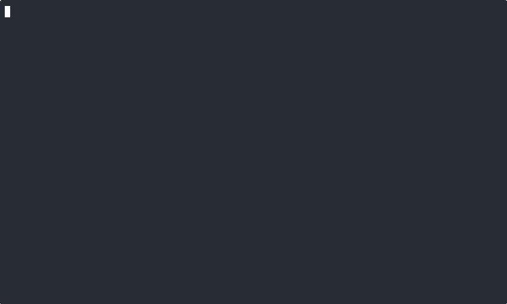

# ted

ted is a tabular editor. It displays database tables as markdown table and provides spreadsheet-like editing, including mouse support for selecting cells (with Opt key) or adjust column widths.



```
 ◔ created_at > now() - interval '7 days' ⊗
 ⇅ name DESC, org_id ASC ⊗
┌────┬┄┬──────┬──────────┬────────────┬────────────┬───┐
│ id │⁚│ name │ email    │ created_at │ updated_at │ o…│
┝━━━━┿┅┿━━━━━━┿━━━━━━━━━━┿━━━━━━━━━━━━┿━━━━━━━━━━━━┿━━━┥
│  4 │ │ John…│ john.dee…│ 2021-01-01 │ 2021-01-01 │ 3 │
│  5 │ │ Jane…│ jane.don…│ 2021-01-01 │ 2021-01-01 │ 4 │
└────┴┄┴──────┴──────────┴────────────┴────────────┴───┘

█ Status bar ████████████████████████████████████████████
  Command bar
```

```sh
ted [dbname] [tbl]
ted test users
```

`dbname` can either be a database file (sqlite or duckdb) or a database name. The where clause lets you filter down the table.

## Common flags

### Connection info

- `-d` or `--database`
- `-h` or `--host`
- `-p` or `--port`
- `-u` or `--username`
- `--password`

### SQL clauses

- `-w` or `--where`
- `-o` or `--order-by`

### Database shorthands

Only needed for database servers

- `--pg`
- `--my` or `--mysql`

## Supported keyboard shortcuts

cmd/ctrl for mac/windows

### Navigation

1. tab
1. shift+tab
1. arrows
1. home
1. end
1. page up
1. page down
1. cmd+arrow

### Data

1. enter: edit/down/new row (if at bottom)
1. esc: exit from editing, discarding changes
1. shift+enter: edit/up (if at top)
1. shift+del: delete row (shift+space selects row in Excel)
1. cmd+r: refresh data
1. cmd+f: find
1. alt+↑/↓: rearranges row order
1. alt+←/→: rearranges column order
1. ctrl+del: hides column
1. ctrl+</>: increase/decrease column width

## Mouse

Lets you interact with elements, selecting cells, resizing or unhiding columns. Selecting a range of cells lets you copy a csv to clipboard.

1. cmd+click: select cell, change column sort, hidden columns to expand them
1. scroll

## Table UI

Get terminal size to size column widths and how many rows to display.

Focusing a cell always brings its full width into the view.

Each column has a default width of 8 characters + 2 spaces + pipe = 11 characters. 7 columns + 1 pipe = 78 characters. Column minimum width is 3 characters. `…` indicates overflow. Additional columns flow off screen, just like spreadsheets. Focusing a cell minimally scrolls to fit the cell into the editor window.

When editing values with overflow, it overlays _on top_ of the table with a light background. Overflow overlay flows to the right and below the cell. When value overflows the editor window, it word wraps. The editing overlay _never_ exceeds the terminal window size.

Default null sentinel is `\N` (configurable). `\\N` to input actual string.

JSON is treated as text. JSONB is pretty printed.

## Status Bar

Status bar in the bottom row where contextual information can be displayed, like warnings, errors, contextual information.

The status bar default shows the current database.table and the row number/total in the bottom right.

During viewing, show column data type, constraints. During editing, input-specific context, including whether input is "valid"

- run check constraints, test against unique index
- valid int, bool, float, json
- enums
- date time format
- references: preview

When highlighting or editing foreign key references, the status bar shows a logfmt preview. Say we highlight `accounts.owner`, which references the users table: `users: id=1 name='Eric' plan='free'…`.

If the sheet does not have a unique index with not null columns or nulls not distinct, the status bar shows a warning upon opening the file or updating data. The associated records are read-only.

If an update fails, status bar shows error message.

## Data flow

Use streaming to fetch results and split pipe results to display and a temporary file.

The "view" of the table is always just a cache.

Updates are run with `RETURNING *` clause, attempt to update just the row and *not* refresh the entire table.

When updating cells, identify a table's primary keys or unique constraints (even if they are multicolumn). If none exists, warn that updates are "best effort" and are made by `WHERE`'ing matching values. If the number of rows updated >1, message in the status bar.

## `.ted.yml` format

`[dbname]` is a filename (sqlite or duckdb) or a database name in the `.ted.yml` config. If no matching name is found and database type flag is not set, suggest `ted init`. Support for tab-completing database (from either local files or config), table and column names.

```yml
databases:
  [name]: <postgres|mysql|clickhouse>
  [name]:
    type: <postgres|mysql|clickhouse>
    host: [host] # opt
    port: [port] # opt
    user: [user] # optional, assumes system username
    dbname: [dbname] # opt, assumes name

    users: # table
      frozen: [id, name]
      columns: # order and width
        name # default
        preferences: 20
        project_cache: 0

null: <null> # default is \N
```

`.ted.yaml` can be used to store table column order and width. All columns should appear by default with a width of 8. You can only hide columns, which displays like hidden spreadsheet columns: `◂│▸`. Those unicode characters are `cmd+click`-able to show column.

All columns selected by default. Extra data from table columns shouldn't matter _that_ for this use case.

### Example

```yml
databases:
  test: postgres
  bloggy:
    type: postgres
    username: bloggy
```

## Nice to have's

Undo/redo with `cmd+z` and `cmd+shift+z` shortcuts.

If primary key does not exist, use sqlite/duckdb `rowid` or postgres `ctid`. This approach is vulnerable to non-exclusive access (updates) or VACUUMs. Also requires modifying update `RETURNING *, rowid|ctid`. It does not work for mysql or clickhouse. Throw a warning in the status bar if using this approach.

Tabs, split views

## Non-goals

Transactions. This is an editor, not a sql editor or a psql replacement.

Column filtering or sorting. You're re-implementing SQL at this point.

Support for views. Incredibly difficult to trace a view column to its source table. Editing via views is not useful. `WHERE`, `ORDER BY` and `LIMIT` are supported as flags, which should cover most cases.

DDL. This is for editing data, not schemas. DDL is best done with SQL.

Real-time database updates. This is not possible without modifying the database (adding triggers). You also do not want to lock the table from external writes: this should not be necessary in local development and is never a good idea in production.

Pasting cells (separate from pasting values). Unclear how you'd map things, especially if focus is not on the first column.

## Development

```sh
watchexec --restart --exts go,mod,sum -- 'go install'
ted test.db users 2>/tmp/ted.log
tail -f /tmp/ted.log
`

